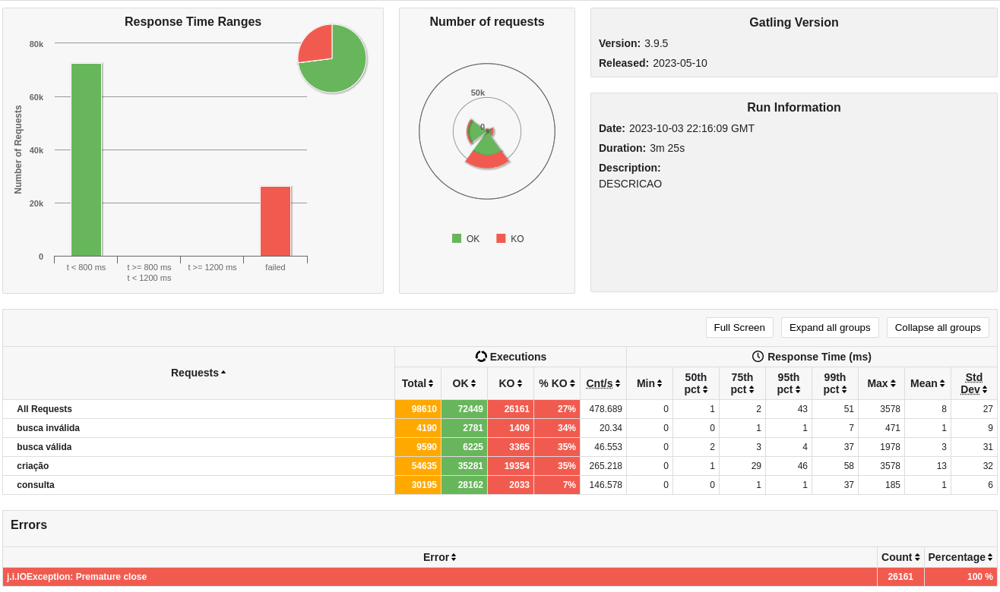
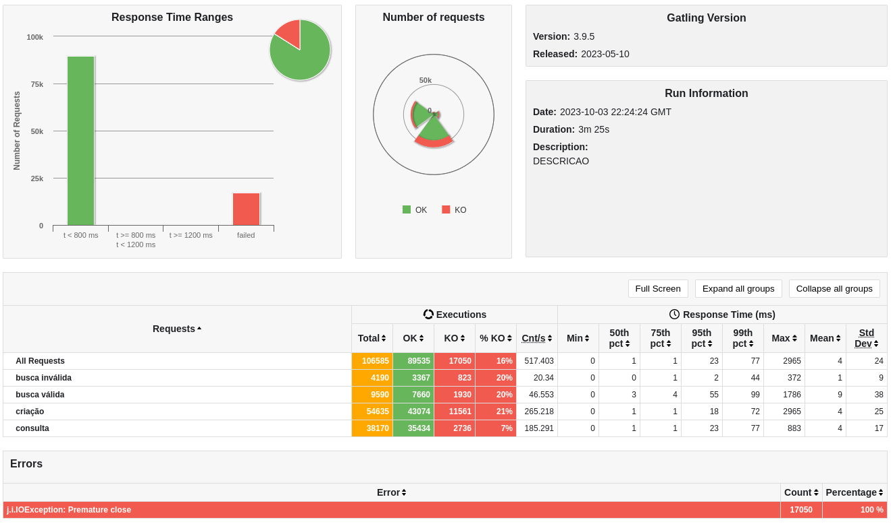

# Rinha de Backend - API

### I decided to create an API in Java using the Spring WebFlux framework with Java 17 for demonstration purposes

### Technologies used

- Java 17
- Spring Boot Reactive WebFlux 3.X
- Docker
- Redis
- Postgres
- Nginx

I built 3 versions for a person's <b>save</b> in the database.

<ul>
<li>The first version is a simple sequential process of saving to the bank and then saving to the cache, but using bounded elastics schedulers for processing in different threads</li>
<li>The second version is quite similar to the first, however instead of saving directly to the database, we will save to the cache and then emit an event using Reactor's Sinks.Many for insertion processing in another thread outside the HTTP request</li>
<li>And finally, the third version involves carrying out the processes of both saving to the cache and emitting the event concurrently using Mono.zip, also from Reactor</li>
</ul>

The three versions can be found in the project's src directory.

### Result

Version number 1 on the save people into database  
**Method into controller > createPessoaV1()**  
**inserts: 30195**

[v1_test.pdf](v1_test.pdf)

Version number 2 on the save people into database  
**Method into controller > createPessoaV2()**  
**inserts: 36686**

[v2_test.pdf](v2_test.pdf)

Version number 3 on the save people into database  
**Method into controller > createPessoaV3()**  
**inserts: 36186**

[v3_test.pdf](v3_test.pdf)

To run the project you first need to comment the endpoint that you do not want to test within the PessoaController class

Depois executar o comando:

`docker-compose up -d`

Although it still isn't a good number of insertions, here I'm getting a lot of "On premature Close" errors, even making the docker network in "host" mode

Well, that's it, it shows that it is also possible to achieve much better response time numbers than the results of the fight itself, looking at 99pct

## Good studies!